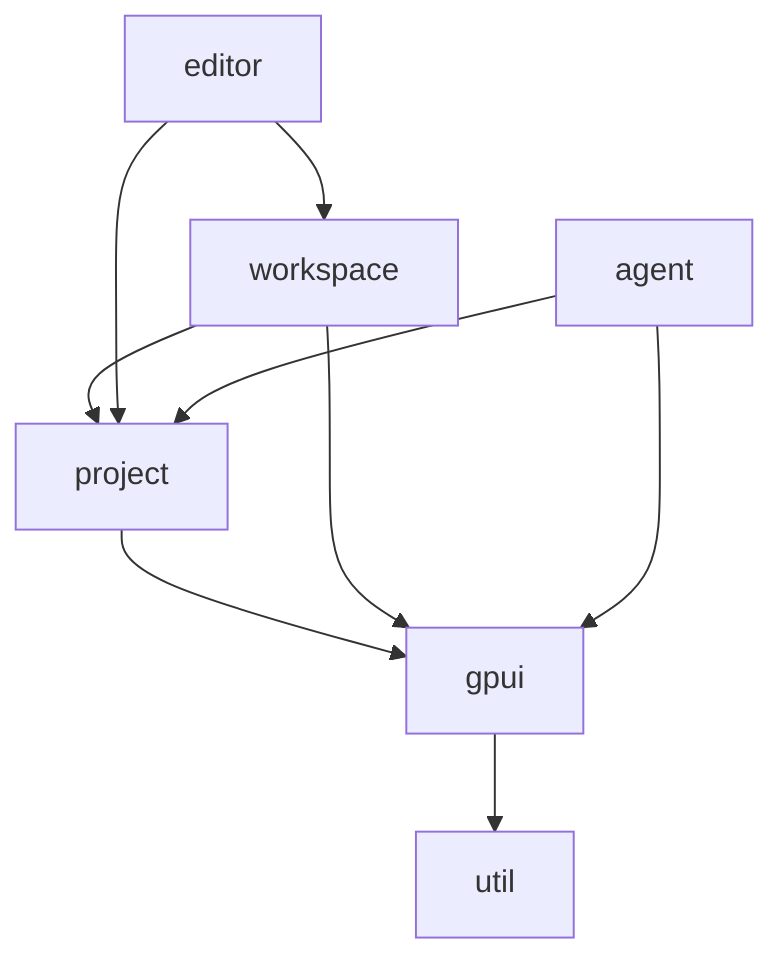

# Chi Code API 参考文档

本文档详细介绍了 Chi Code 项目的核心模块结构、公开 API 以及模块间的依赖关系。

## 1. 核心架构概述

Chi Code 基于 Zed 的架构构建，采用了响应式的、由 GPU 驱动的 UI 框架。其核心设计理念是：
- **Entity-View 系统**：UI 组件（View）是存储在中心仓库中的实体（Entity）。
- **Context 驱动**：所有的状态变更和生命周期管理都通过 `Context`（如 `AppContext`, `WindowContext`）进行。
- **异步优先**：利用 Rust 的 `async/await` 处理 I/O 和耗时任务，保持 UI 流畅。

## 2. 核心模块分析

### 2.1 GPUI (`crates/gpui`)
GPUI 是整个项目的基石，提供了一个类似于前端框架（如 React/Vue）但面向 Rust 原生的 UI 模型。

**主要公开 API:**
- `AppContext`: 全局应用上下文，用于管理实体、全局状态和异步任务。
- `WindowContext`: 窗口级上下文，用于处理窗口相关的操作（如下拉菜单、焦点切换）。
- `View`: 一个 Trait，任何实现 `Render` 的类型都可以作为一个 View。
- `Entity<T>`：对实体的类型安全句柄。
- `actions!`: 宏，用于定义可被键盘快捷键绑定的操作。

### 2.2 Workspace (`crates/workspace`)
Workspace 负责管理窗口的主体结构，包括面板（Pane）、托盘（Dock）和状态栏。

**主要概念：**
- `Workspace`: 核心结构，管理项目状态和窗口布局。
- `Pane`: 用于容纳 `Item`（如编辑器、终端）的容器。
- `Item`: 任何可以放置在 Pane 中的组件（必须实现 `Item` trait）。
- `Panel`: 可以放置在侧边栏或底部 Dock 中的组件。

**关键 API:**
- `Workspace::new`: 创建新的工作区窗口。
- `workspace::register_project_item`: 向工作区注册新的项目类型。

### 2.3 Editor (`crates/editor`)
Editor 是功能最复杂的 View，负责文本渲染和交互。

**核心设计：**
- `MultiBuffer`: 支持多文件片段（Excerpts）联合编辑的缓冲区模型。
- `DisplayMap`: 负责将原始文本映射到显示坐标（处理折行、折叠、内联提示）。
- `Selections`: 管理多个光标和选择区域。

**主要 API:**
- `Editor::for_buffer`: 为给定的 `Buffer` 创建编辑器。
- `Editor::single_line`: 创建单行输入框编辑器。

### 2.4 Agent (`crates/agent`)
Agent 模块负责 AI 能力的集成，通过 Agent Client Protocol (ACP) 与后端模型通信。

**主要组件：**
- `Thread`: AI 对话线程，管理上下文和消息流。
- `NativeAgent`: 运行在本地的 Agent 服务，处理工具调用（Tool Use）和模型分发。
- `LanguageModel`: 抽象语言模型接口。

## 3. 模块依赖关系



**依赖层级：**
1. **底层库**: `util`, `collections`, `sum_tree`, `gpui`
2. **业务逻辑层**: `text`, `language`, `project`, `client`
3. **UI 框架层**: `theme`, `ui`, `workspace`
4. **功能组件层**: `editor`, `terminal`, `agent`, `vcs`

## 4. API 设计模式

### 4.1 更新模式 (Update Pattern)
Chi Code 严格遵循 `update` 模式。要修改任何被 Entity 包装的状态，必须使用 `cx.update` 或类似的闭包机制。这确保了状态变更可以被订阅者感知。

```rust
// 示例模式
entity.update(cx, |this, cx| {
    this.do_something();
    cx.notify();
});
```

### 4.2 订阅模式 (Subscription)
通过 `cx.subscribe` 或 `cx.observe` 监听其他 Entity 或全局状态的变化。

### 4.3 Action 系统
通过宏定义的 Action 是系统内通信的主要方式，解耦了 UI 触发逻辑与具体业务实现。

## 5. API 设计建议与问题

1. **复杂性管理**：`Editor` 模块过于庞大（超过 2 万行），包含了过多的私有状态和复杂的映射逻辑，建议进一步拆分子模块（如将 Git 处理和诊断处理完全插件化）。
2. **Context 类型繁多**：`AppContext`, `Context<T>`, `WindowContext`, `ViewContext<T>` 等类型容易混淆，新手接入成本较高。建议在文档中进一步明确各类 Context 的适用场景。
3. **Agent 模块解耦**：目前的 `agent` 模块与 `project` 耦合较深，如果未来 Chi Code 需要支持非项目制的 AI 交互，需要重构 `Thread` 的上下文获取逻辑。

## 6. 结论
Chi Code 的 API 设计非常强调高性能和响应式，采用了先进的 Entity-Component 思想。核心模块之间的界限清晰，但在某些大型模块内部（如 Editor）存在过度耦合的风险。
